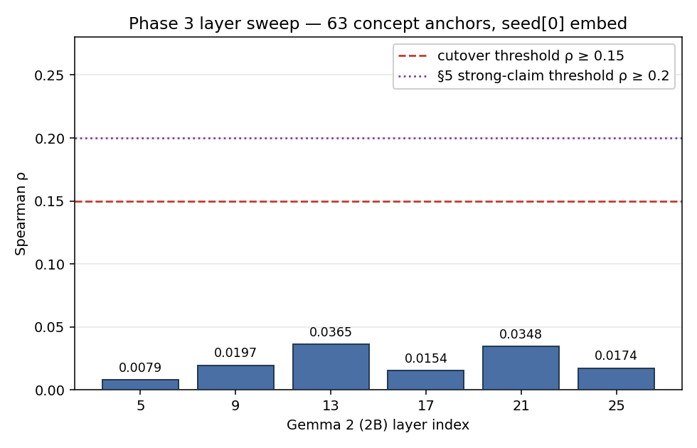
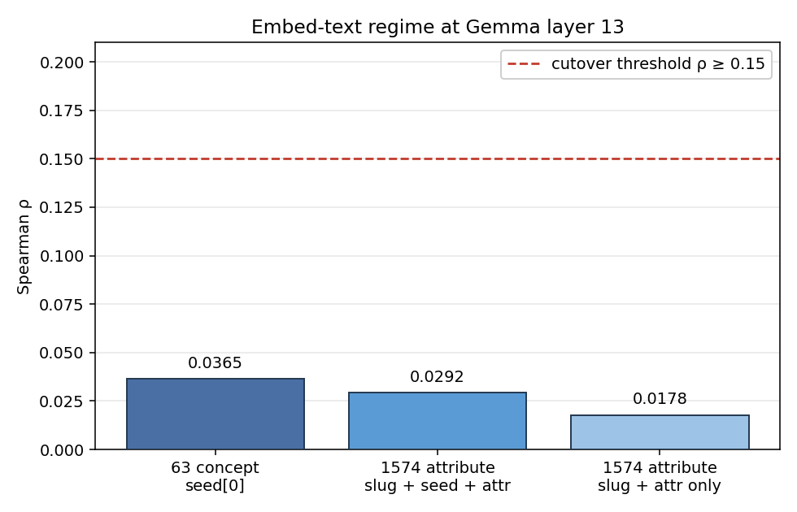
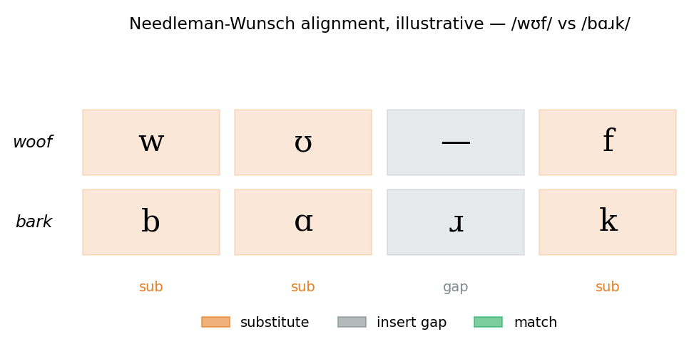

# Phase 3 — Onomatopoeia as anchors for a phonosemantic cutover

This page is the send-off for an experiment that didn't work the way we
hoped, and explains why the apparatus we built for it is still in the
toolbox. It targets readers who haven't been inside the codebase. Jargon
is glossed inline the first time it appears.

## 1. The setting

The interlingua project assigns a word — a *stem* — to each of ~2000
meaning clusters extracted from Gemma 2 (2B). Today those stems are
chosen by a deterministic hash within phonotactic rules. The hash is
fast, predictable, and entirely arbitrary: two meanings that are
conceptual neighbors in the model's geometry get stems with no audible
relationship. *House* and *river* aren't any closer in sound than *house*
and *spite*. The language has no sound symbolism.

The proposed alternative — the **cutover** — replaces the hash with
interpolation from a small pool of iconic anchor words. The anchor pool
is a hand-curated set of concepts whose pronunciation is known to carry
meaning: onomatopoeias like *snake* → "hiss", *dog* → "woof", *thunder*
→ "boom". For each of the 2000 meaning clusters in the substrate, we'd
look at its position relative to those anchors in Gemma's embedding
space, and synthesize a stem whose phonology is a weighted blend of the
anchors' phonology. Result: similar meanings → similar pronunciations,
by construction. Animal sounds drift toward one part of the inventory,
mechanical sounds toward another.

This earns its complexity only if one thing is true: the model's
"nearby in meaning" actually corresponds to "nearby in sound" for the
anchor pool. If iconic words that *sound* alike (hiss, fizz; woof, ruff)
also *embed* alike inside Gemma — i.e., the model has noticed and stored
their phonosemantic kinship — then the interpolator has something to
interpolate from. If not, interpolation just produces phonological noise
dressed up as meaning, and we can't earn the complexity cost.

So Phase 3 is the precondition test for the cutover.

## 2. The method

The setup, end-to-end:

- **Substrate.** 2000 meaning clusters, each a 2304-dimensional vector
  from Gemma 2 (2B)'s residual stream (the model's running notepad at a
  given layer) at layer 13.
- **Anchor pool.** 63 iconic concepts (snake, dog, thunder, fizz, …).
  For each anchor we know its Gemma embedding *and* its IPA pronunciation
  (IPA = the International Phonetic Alphabet, the symbols linguists use
  to spell sounds unambiguously).
- **Interpolation.** For every substrate vector, build a candidate stem
  by interpolating phonological features from the nearest anchors,
  weighted by embedding proximity. Function:
  `conlang.interpolate.stem_for_position(vec, ctx)`.
- **Sample 10,000 random pairs** from the substrate (seed=0, reproducible).
- **For each pair, compute two distances:**
  - *Semantic distance:* cosine distance between the two decoder
    vectors. (Cosine distance is the angle between two embedding
    vectors, 0 = identical direction, 1 = perpendicular.)
  - *Phonological distance:* Needleman-Wunsch alignment between the
    two interpolated stems over panphon feature vectors. (NW =
    Needleman-Wunsch, an algorithm that lines up two sequences by
    inserting gaps wherever they don't match. panphon = a library that
    turns IPA into 24-dimensional ternary (+, –, 0) feature vectors.)
- **Spearman ρ** between the two distance series. (Spearman ρ measures
  how strongly two rankings agree, from –1 (opposite) through 0 (no
  relation) to +1 (identical).)

What the thresholds mean:

- **ρ ≥ 0.15** (cutover threshold from §3 of `semanticphonology.md`):
  interpolation works well enough to replace the hash. Phonological
  neighbors and semantic neighbors actually overlap.
- **ρ ≥ 0.20** (strong-claim threshold from §5): the broader claim
  *consonant directionality is the load-bearing claim* holds. Consonant
  features alone carry enough signal to drive a phonosemantic system.
- **ρ < 0.15**: the cutover doesn't earn its complexity. The hash stays.

## 3. The apparatus

What we built to run this:

### The anchor pool with attribute bundles

Each of 64 concepts (`src/conlang/lab/attributes.py`) carries 12
perceptual attributes, 3 affect attributes, and 10 cultural attributes.
Cultural attributes are deliberately contradictory across traditions —
the philosophical lean is that an anchor's "meaning" in a multilingual
model is the sum of those contradictions, not any single tradition.

Two samples:

> **snake_hissing**
> *perceptual* — close-to-ground, elongated, smooth-scaled, flexible,
> sinuous, sudden-strike, concealed, cold-blooded, venomous,
> silent-movement, fork-tongued, shedding-skin
> *affect* — dread-inducing, primal-fear-trigger, alarm-signal
> *cultural* — wisdom-symbol-asian, evil-bringer-abrahamic,
> fertility-renewal-mesoamerican, cunning-trickster-mediterranean,
> healing-caduceus-greek, ritual-taboo-judaic,
> kundalini-life-force-hindu, primordial-chaos-jormungandr-norse,
> fortune-zodiac-chinese, ancestor-spirit-west-african

> **dog_barking**
> *perceptual* — domestic, loyal, alert, protective, playful,
> fast-runner, carnivore, four-legged, tail-wagging, scent-tracking,
> pack-bonded
> *affect* — comforting-presence, warning-signal, alarm-trigger
> *cultural* — faithful-companion-western, ritually-unclean-islamic,
> ritually-impure-japanese-folkloric, psychopomp-anubis-egyptian,
> demonic-mesopotamian, hunting-noble-medieval-european,
> fortune-zodiac-chinese, loyalty-virtue-confucian,
> scavenger-pariah-south-asian, spirit-guide-mesoamerican-xolotl

Snake is *both* wisdom-symbol *and* evil-bringer. Dog is *both*
faithful-companion *and* ritually-unclean. That's the design.

### A dual-mode embedding probe

`embed_positions.py` takes an anchor — concept *or* attribute — and runs
it through Gemma 2 (2B), extracting the residual stream at a chosen
layer (Gemma 2 (2B) has 26 layers; layer 13 is the middle, where lexical
semantics live most strongly). Two knobs: `--anchor-level
{concept,attribute}` and `--layer-index`. Defaults: attribute-level,
layer 13, embed-text format `f"{slug} ({seed}) :: {attr}"`. Concept-level
mode is preserved for A/B comparison.

### Needleman-Wunsch phonological distance

`project.py:phonological_distance`. The previous kernel scored each stem
position independently. NW lets two stems align by inserting gaps, so
*boom* vs *broom* is more similar than position-aligned scoring would
give (the *oom* parts line up cleanly with an inserted *r* in *broom*).

## 4. The measurements

All measurements: N=2000 substrate, NW phonological-distance kernel,
Gemma 2 (2B) residual mean-pool, 10,000 random feature-pairs (seed=0).
The `layer` column is the index into `hidden_states[i]` (layer 13 =
output of transformer block 12).

| Date | Anchors | Embed text | Layer | ρ | p |
|---|---|---|---|---|---|
| 2026-05-18 | 63 concept | `english_seeds[0]` ("hiss") | 13 | **0.0365** | 2.65e-4 |
| 2026-05-18 | 63 concept | `english_seeds[0]` | 21 | 0.0348 | 4.92e-4 |
| 2026-05-18 | 1574 attribute | `f"{slug} ({seed}) :: {attr}"` | 13 | 0.0292 | 3.46e-3 |
| 2026-05-18 | 63 concept | `english_seeds[0]` | 9 | 0.0197 | 4.86e-2 |
| 2026-05-18 | 1574 attribute | `f"{slug} :: {attr}"` | 13 | 0.0178 | 7.62e-2 |
| 2026-05-18 | 63 concept | `english_seeds[0]` | 25 | 0.0174 | 8.18e-2 |
| 2026-05-18 | 63 concept | `english_seeds[0]` | 17 | 0.0154 | 1.24e-1 |
| 2026-05-18 | 63 concept | `english_seeds[0]` | 5 | 0.0079 | 4.30e-1 |

The layer-sweep is flat-and-low. Layers 13 and 21 tie within noise at ρ
≈ 0.035; early layers (5, 9) and late layers (17, 25) drop toward zero.
No layer hides a plateau. There isn't a "right depth" we missed.

The granularity-vs-embed-text test is the more telling negative. Going
from 63 concept anchors to 1574 attribute anchors is a 25× density
increase — and ρ *dropped* (0.0365 → 0.0178). Putting the iconic seed
back into the attribute embed string (`f"{slug} ({seed}) :: {attr}"`)
partially recovered the loss (0.0292), but never beat the concept-level
baseline. The iconic seed is doing real work; the attribute prose around
it is dilutive. Whatever modest correlation we have likely *is* the
seed's iconicity leaking through Gemma's residual, not the attribute
structure paying off.

(NW illustration: lining up *woof* /wʊf/ against *bark* /bɑɹk/ inserts
gaps and substitutes; the closing /f/ vs /k/ pair lines up, the middle
vowels substitute, and the onsets /w/ vs /b/ substitute too.
Phonological distance is the sum of substitution + gap costs over the
optimal alignment.)

## 5. The verdict

Best measured ρ across every configuration tried — anchor count from 63
to 1574, embed format from bare seed through slug + attribute to slug +
seed + attribute, Gemma layers 5 through 25 — is **ρ = 0.0365**, against
the §3 cutover threshold of 0.15 and the §5 strong-claim threshold of
0.20. The hypothesis is falsified at this scale.

**Consequence for the project:** `build_stem()` stays as the
deterministic hash. The `lexicon-pre-cutover` tag at commit `af1c965`
remains the live deliverable, not a fossil. The hash isn't *wrong* —
it's that we couldn't earn its complexity-cost replacement with
measurable semantic coherence inside Gemma 2 (2B). The §5 question
*consonant directionality is the load-bearing claim* answers **no,
consonant features alone are not enough**, at least at this model scale
and this substrate granularity.

**Conditions to reopen:**

- A different model — bigger, or one trained with sound-symbolism
  objectives baked into its corpus or loss.
- A different substrate — more features, a different SAE layer, or a
  non-SAE feature source.
- A different distance kernel — the current NW weights all
  feature-edits equally; alternatives could weight sonority class or
  articulatory place more heavily.
- A richer phonology — more than the current 10-consonant / 5-vowel
  inventory; perhaps tone, length, or stress as additional dimensions.

## 6. What we kept

The negative result is itself information. The apparatus that produced
it — the anchor-bundle framework, the dual-mode embed probe, the
Needleman-Wunsch phonological-distance kernel, the Spearman validator —
lives in `src/conlang/lab/`. It's reusable for:

- A re-test on a different model. Swap the Gemma 2 (2B) call in
  `embed_positions.py` for a larger or differently-trained model.
- A different conlang design entirely. A future project that wants to
  optimize for *fun* sounds rather than embedding-validated sounds can
  fork from `lab/` without re-implementing the phonology toolkit.
- Anchor-pool work that isn't about phonosemantic cutover at all. The
  64 attribute bundles are a rich starter for any project that wants to
  model "this concept feels like…" in a multilingual model.

The conclusion isn't "the experiment failed." The conclusion is: at this
model scale, on this substrate, with this anchor pool, we measured the
proposed precondition for an interpolated phonosemantic system, and the
precondition didn't hold. The interlingua repo's lexicon stays on the
hash, and the toolkit moves to the workshop shelf — labeled, indexed,
and ready for the next time someone has a reason to ask whether sound
and meaning can be made to rhyme inside a transformer.
