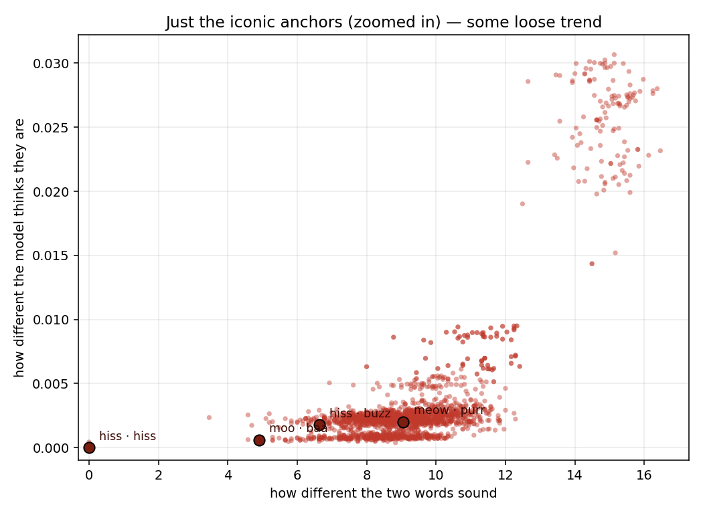
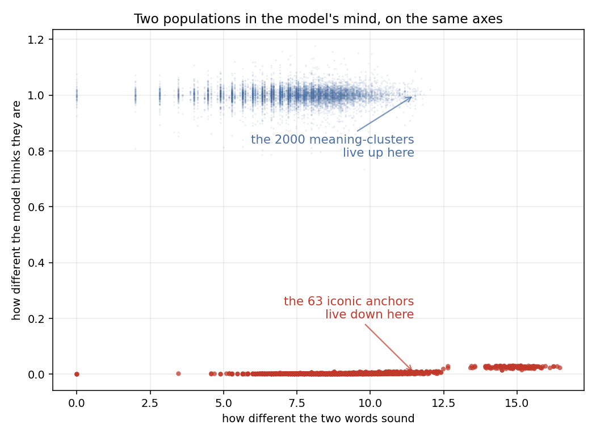
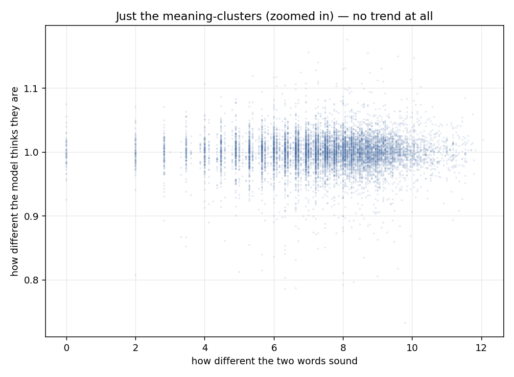
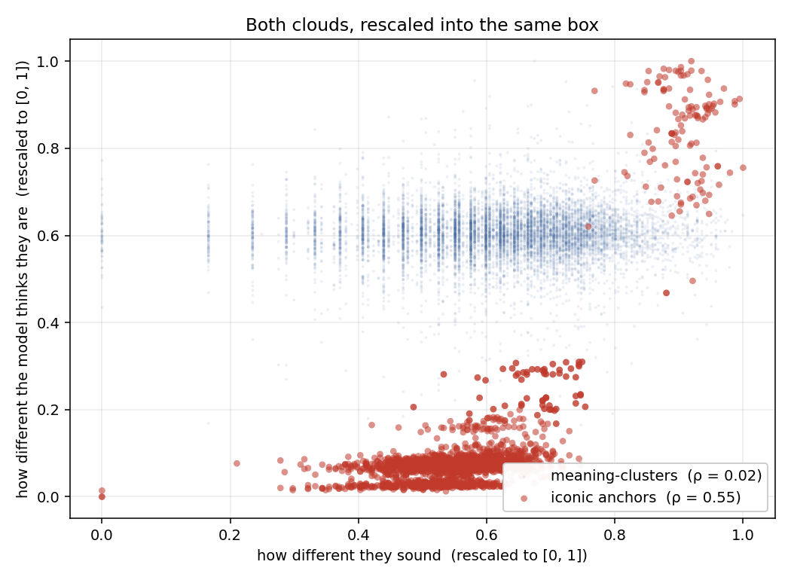

# An experiment in sound and meaning

You have probably noticed this without thinking about it. The English
say *woof*. The Japanese say *wan-wan*. The Koreans say *meong-meong*.
Three languages, three traditions, three completely different words —
and yet recognizably about the same animal. The sounds we choose for
animal calls, for collisions, for sneezes and bells and laughter, are
not the same across the world. But they are not entirely arbitrary
either. A snake hisses in your language too. Cows say something close
to *moo* across enough of the world that you start to wonder.

Linguists have wondered for a long time. There is a hypothesis, very
tempting, that some words *feel* the way they mean. The demonstration
most people have heard of is *bouba* and *kiki*: given a round blob
and a spiky star, almost everyone agrees which is which. There is
*something* in those sounds that human ears hear as round, and
something else they hear as sharp.

We wanted to use that something to build a language.

## The dream

The interlingua project takes a large language model and asks it: what
are the meanings you have learned? Roughly two thousand of them emerge
— coherent clusters the model has noticed across millions of pages of
human writing. Each cluster will become a word.

Until now, the way we picked each word was by hashing. Every cluster
got a pronounceable but completely arbitrary sequence of sounds.
*River* and *house* were no more alike in pronunciation than *house*
and *spite*. Functional. Predictable. Soulless.

The plan was to do better. We collected a small pool of words whose
sounds seem to carry their meaning even across cultures: the iconic
ones, *hiss* and *woof* and *moo* and *boom*. We thought: if a new
meaning lives near "snake" in the model's mind, give it some hiss in
its sound. If it lives near "thunder," give it some boom. By the time
you had built up two thousand words, the language would have a kind
of inner rhyme. Things that meant alike would sound alike. The dream
was that the language would *feel* like its meanings, instead of
being painted onto them.

It only worked if one thing was true.

## The question

For the plan to work, the model had to already think iconic sounds go
together with iconic meanings. Not in any sophisticated way — just
that *hiss* and *fizz* should be slightly more related, in its
internal sense of "relatedness," than *hiss* and *thump* are. We were
not asking the model to be a poet. We were asking only that it had
absorbed, from billions of pages of text, that certain pairs of iconic
words feel related and others do not.

If yes, our anchors had something to anchor to, and the language we
hoped to build would feel coherent. If no, every "sound symbol" we
tried to assign would be a coin flip, and we were back to the hash.

So we asked.

## A first picture, with a flicker of hope

We took the iconic onomatopoeias — sixty-three of them, gathered
across many languages — and for every pair we measured two things.
How alike do they *sound*. How alike does the model think they *mean*.

There is a faint diagonal in there. Pairs of iconic words that sound
alike do tend to be pairs the model considers a bit closer in meaning.
*Hiss* and *hiss* — the same word reused for two different hissers
(snake and cat) — sit on top of each other, naturally. *Moo* and
*baa* are not the same sound, but they are not far apart, and the
model puts them very close in meaning, because they are both farm
animals. *Meow* and *purr* sound nothing alike, but they belong to the
same animal, and the model knows it.

It is loose. Far from a tight diagonal. But it is not a blob. There
is some bridge between sound and meaning in the model's idea of
iconic words. We almost cheered.

## A second picture, with the cold facts

Then we looked at the bigger picture.

The two thousand meaning-clusters the language was meant to cover are
*not* iconic onomatopoeias. They are concepts the model picked out
from human writing: ideas about places, machines, relationships,
emotions, weather, history. A handful of them might overlap with our
anchor pool, but the vast majority do not.

So we asked, on the same axes: where do those two thousand meanings
*live*, in the model's geometry, compared to our iconic anchors?

The iconic anchors all huddle along the bottom of the chart — to the
model, they all feel mutually similar, a small cohesive family. They
have an inner geometry, and within it sound and meaning loosely track.

The two thousand actual meaning-clusters live far above, in their own
cloud. The model considers them, on average, very far from any of our
iconic words. Whatever phonosemantic structure exists among
onomatopoeias does not reach out to the rest of meaning-space.

When we try to use the anchors anyway — when we ask the iconic words
to *vote* on the pronunciation of a meaning-cluster they live far
away from — there is nothing to vote with. The signal that gave us
the faint diagonal in the first picture has no traction here.

The picture is a cloud, edge to edge. The invented stems for the two
thousand meaning-clusters sound however they sound, and the model
disagrees that meanings should track those sounds. The diagonal is
gone.

## A second look — but wait, don't the two clouds *look* the same?

It is tempting to set the two scatters next to each other and think:
the meaning-clusters are just the iconic anchors *at a different
scale*. Maybe both clouds carry the same shape, the same fan, the
same hidden diagonal, and the only thing that differs is the size of
the room they're drawn in. If that were true, the cutover might still
work — we'd just need to mind the scale.

It is a good intuition. Let's test it.

If we take both clouds and stretch them into the same square, edge to
edge, here is what we get.

What they *share* is the fan. Both are wider on the right than on the
left. That is a real visual feature, and it comes from sampling: pairs
of words that nearly rhyme are rare in any pool, so there are fewer
dots on the left than on the right, and a few dots can never fill as
much vertical space as many dots can. Whatever pool you draw from,
this fan will appear.

What they *don't* share is the climb. The red anchors go up and to the
right. The blue meaning-clusters stay flat. The shape of the red cloud
has a diagonal inside its fan; the blue cloud is just a fan with
nothing inside it.

The math we've been running quietly all along measures only the climb,
not the fan — that is what the numbers on the legend mean. The
anchors have a real climb. The meaning-clusters do not. Rescaling
makes the two clouds look more similar, but it doesn't put a climb in
the blue cloud where one wasn't to start with.

The visual rhyme between the two shapes is real, but it is the rhyme
of how *many* pairs land where, not the rhyme of *how those pairs
behave*. The structure the cutover would need to walk over still isn't
there in the blue.

## What it means

This is, in a small way, news.

Sound symbolism is real in humans — generations of linguists have
confirmed that. The bias for *bouba* and *kiki*, the cross-linguistic
agreement on hisses and woofs, the way poets exploit phonosemantic
resonance — all of those are present in us.

A model trained on text has *some* of it, but only locally. It has
absorbed that iconic words live near each other, and that among them,
the ones that sound alike tend to mean alike. That is real and quiet
and lovely. But it has not absorbed any larger principle that would
let it extend the pattern outward — that would let it think *banker*
or *gravity* or *forgiveness* deserve sounds in any particular
neighborhood.

The model has a small inner garden where sound and meaning rhyme.
The garden does not extend to the rest of its mind.

That tells us something interesting about what these models contain.
It also tells us, more practically, that we cannot use this trick to
build the language we hoped for. The bridge we wanted to build between
sound and meaning is only there for words that already have the
property; we cannot use it to give the property to words that don't.

## What we kept

The language did not lose anything. The hashed words are still good
words — pronounceable, unambiguous, deterministic. The lexicon ships
the same way it always has.

What we keep, alongside that lexicon, is the workshop. The little
catalog of iconic concepts and the cross-cultural shadings of their
meanings, the tools for asking what a model considers near what, the
experiment itself — all of it lives together in `src/conlang/lab/`.
The next time someone has reason to ask the same question of a
different model, or a model trained on more than text, or a model
that has somehow heard the words it reads, the apparatus is ready.

Sometimes a finding is *not here, not in this form.* That is also a
finding worth filing away. The garden exists. Now we know its walls.
